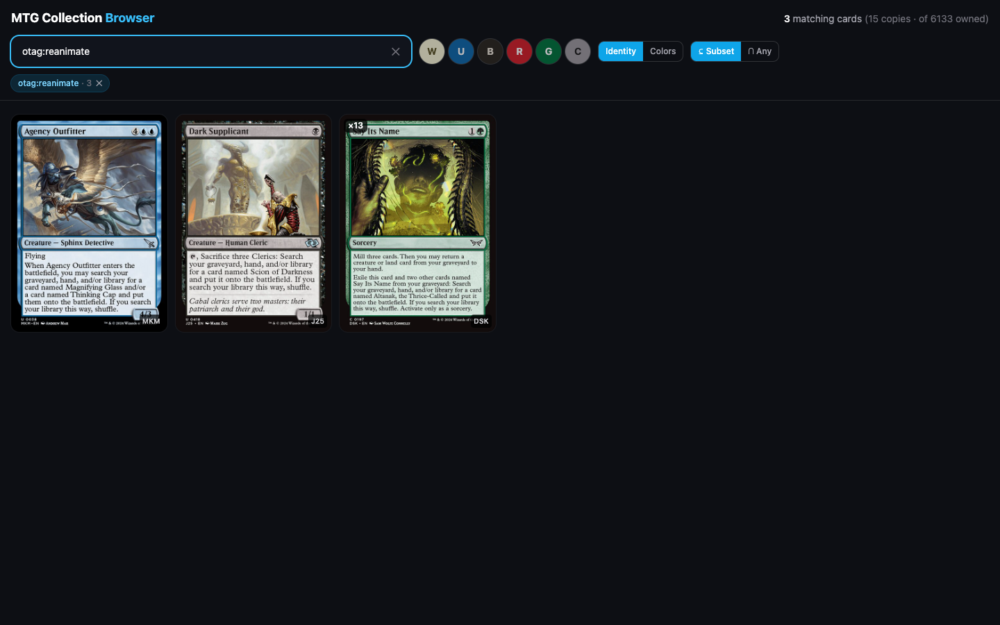
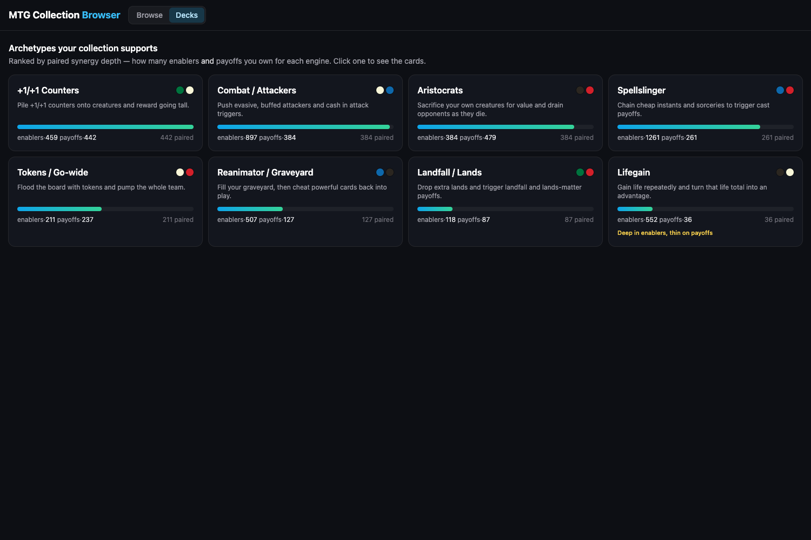

# MTG Collection Browser

A single-page app for the Magic: The Gathering cards you own. Two views:

- **Browse** — filter your cards by Scryfall **oracle tags** (e.g. `otag:reanimate`) and **color**.
- **Decks** — a **synergy recommendation engine**: ranks the deck archetypes your collection best
  supports (by how many enablers *and* payoffs you own), and suggests cards that pair well together.

Built with **Vite + React + TypeScript + Tailwind**. All filtering and scoring runs client-side over a
small, pre-built dataset of just your collection (~6k cards) — no backend.




## How it works

Three source files are joined once, at build time, into two small JSON files the app ships:

| Source (in `data/`, gitignored) | Role |
| --- | --- |
| `ManaBox_Collection*.csv` | Your collection (ManaBox export). `Scryfall ID` + `Quantity` + `Foil`. |
| `default-cards*.json` | Every Scryfall printing. Joined to the collection by printing `id` (**100% match**), giving each owned card its `oracle_id`, image, colors, type, etc. |
| `oracle-tags*.json` | Scryfall oracle tags. `taggings[].oracle_id` links tags to cards. |

The join chain is: **ManaBox `Scryfall ID` → `default-cards.id` → `oracle_id` → oracle tags.**
Output lands in `public/data/cards.json` (~3.5 MB), `public/data/tags.json` (~0.3 MB), and
`public/data/archetypes.json` (~5 KB), which are committed and served statically.

> The 547 MB `default-cards` file is **streamed** during preprocessing, so memory stays low.

The build also resolves the **synergy ontology** (`src/lib/ontology.ts`) against the Scryfall oracle-tag
**DAG**: each archetype role references hub or exact tag slugs, which preprocessing expands to every
descendant slug present in your collection (the DAG itself is never shipped). See *Synergy recommendations*.

## Quick start

```bash
npm install

# 1. Put the three source files in ./data/  (filenames may carry timestamps)
#    - ManaBox_Collection*.csv
#    - default-cards*.json     (Scryfall "Default Cards" bulk data)
#    - oracle-tags*.json       (Scryfall oracle tags export)

# 2. Build the static dataset (re-run whenever the sources change)
npm run preprocess
#    -> writes public/data/cards.json + tags.json + archetypes.json; runs sanity asserts

# 3. Run the app
npm run dev          # http://localhost:5173
```

Other scripts: `npm run build` (typecheck + production build to `dist/`), `npm run preview`,
`npm run typecheck`, `npm run verify` (sanity-checks the search/filter logic against the data).

## Using the app

- **Search** by card name, or type `otag:<slug>` (also `tag:` / `t:`) for an oracle tag.
  Autocomplete suggests tags **present in your collection**, with owned counts and descriptions.
- Multiple `otag:` filters are **AND**-ed. Click a tag chip in a card's detail view to add it.
- **Color filter** (W/U/B/R/G/C):
  - *Identity* (default, EDH-relevant) vs *Colors* axis.
  - *Subset* (default): card's colors ⊆ selected — "playable in a deck of these colors".
  - *Any*: card shares at least one selected color.
- Click any card for a detail modal (flip button for double-faced cards, full tag list,
  **Synergizes with** suggestions).

## Synergy recommendations (Decks view)

Switch to **Decks** for the recommendation engine. It models a synergy as an **enabler → payoff**
relationship: an *enabler* produces a resource or condition (a sacrifice outlet, self-mill, a token
maker) and a *payoff* rewards it (death triggers, reanimation, anthems). An **archetype** bundles an
enabler set with a payoff set.

- **Dashboard** ranks archetypes by *paired synergy depth* — the engine is `min(enablers, payoffs)`,
  so owning **both halves** matters. A deep but unpaired bench only nudges the score, and an archetype
  whose thin side is genuinely scarce is flagged (e.g. *"Deep in enablers, thin on payoffs"*).
- **Detail** (click an archetype) groups your owned cards into **Enablers** and **Payoffs**, with a
  color-identity sub-filter to scope to a buildable color combination.
- **Synergizes with** (in any card's modal) ranks the owned cards that pair best with it, each with a
  short reason. Curated enabler↔payoff relations rank highest; weighted (TF-IDF) overlap of
  non-cosmetic tags catches synergies the ontology doesn't name.

**Editing the ontology:** archetypes live in [`src/lib/ontology.ts`](src/lib/ontology.ts) as `ARCHETYPES`.
Each role lists tag slugs — reference a *hub* slug (e.g. `sacrifice-outlet`) to pull its whole DAG
subtree, or an exact leaf slug. `npm run preprocess` warns on any slug that resolves to zero owned
cards, so the ontology stays honest. Cosmetic/structural tags (`alliteration`, `cycle-*`, `*-vanilla`)
are listed in the same file and excluded from synergy signal.

Pure scoring logic lives in [`src/lib/synergy.ts`](src/lib/synergy.ts) (`scoreArchetypes`, `synergyFor`)
and is unit-checked by `npm run verify`.

## Deployment

The app is a static bundle. Commit `public/data/*.json` (the raw `data/` files are gitignored
and not present in CI).

- **Vercel / Netlify**: framework = Vite, build = `npm run build`, output = `dist`. `base` is `/`.
- **GitHub Pages**: a workflow at `.github/workflows/deploy.yml` builds with
  `DEPLOY_TARGET=gh-pages` (sets Vite `base` to `/mtg-deck-creator/`) and publishes `dist/`.
  Enable Pages → Source: "GitHub Actions". For a different repo name, update `base` in
  `vite.config.ts`. Build locally with `npm run build:gh`.

## Notes & edge cases

- Card images load from Scryfall's CDN, so the app needs internet at runtime; broken images
  fall back to a name placeholder.
- Double-faced cards use the front-face image (back available via the modal flip button).
- Duplicate collection rows (same printing across binders / foil+nonfoil) are merged: quantity
  summed, `foil` true if any copy is foil.
- ~0.5% of owned cards have no oracle tags; they still appear in name/color searches.

## Roadmap

- ✅ **Synergy/recommendation engine** — archetype dashboard + card-level "synergizes with" (see above).
- **Build-around seed:** pick a commander/seed card → assemble a deck skeleton from your collection
  (the implied archetype plus your best ramp/draw/removal in that color identity). Reuses the same engine.
- **Synergy pairs feed:** a discovery feed of notable two-card combos already in your collection.
- Tune the ontology: more archetypes, weighted taggings, and per-archetype "support" roles.
